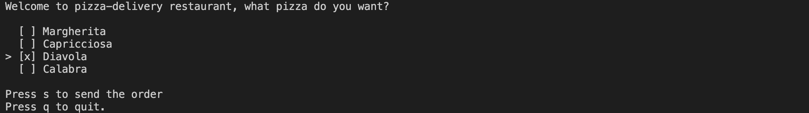
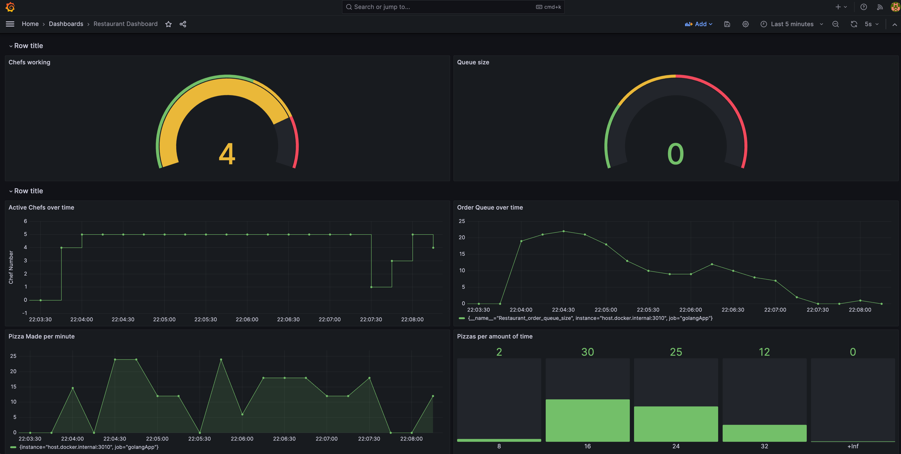

# E-Pizza Simulator

This project simulates a Pizza Restaurant. 

Users can order via the TUI: 
- Pizzas can be selected and then the order is sent to the kitchen
- Orders are queued into a channel
- A maximum of 5 goroutines can run in parallel, they simulate the chefs of the kitchen
- Each chef works on a different order.

The kitchen microservice exposes prometheus compatible metrics:
- Restaurant_active_chefs gauge
- Restaurant_order_queue_size gauge
- Restaurant_pizza_made_total counter
- Restaurant_pizza_making_duration_seconds_bucket histogram

## Microservices
- Kitchen --> it receives orders and delivers finished pizza, it is only triggered when There are Pizzas in the queue.
- Client --> can place orders trough the TUI terminal.

## Table of Contents

- [Installation](#installation)
- [Usage](#usage)

## Installation
1. Clone the project on your local machine
2. go run pkg/kitchen/main.go to start the kitchen microservice
3. go run cmd/main.go to start the TUI terminal to place the orders

## Usage

This project has been built with the only goal of creating a simulator to expose prometheus compatible metrics, visualize them in grafana and play around with different ways of monitoring the app behaviour.

